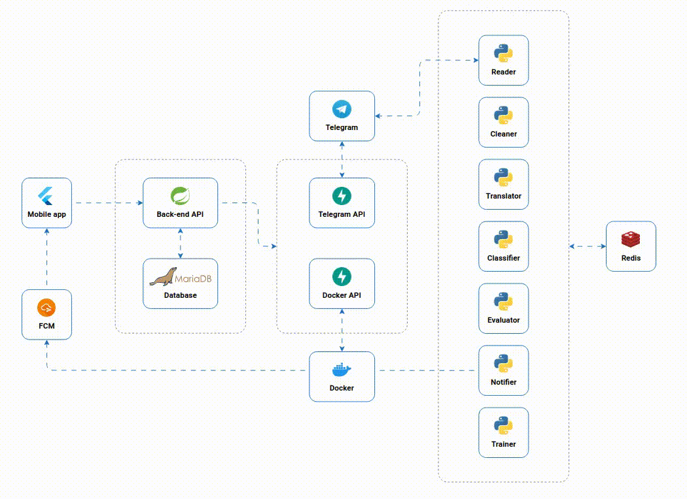

# What is Hermes?

Hermes is an open-source system designed to automate **message filtering** in **Telegram groups**. Many users are subscribed to multiple groups but rarely read all incoming messages. Hermes addresses this issue by **monitoring** selected groups, **processing** messages in real time, and **notifying** users only when relevant content is detected.

The system utilizes **AI-based classification** models to determine message relevance, considering both general criteria and user-specific preferences. Through **continuous learning** from **user feedback**, Hermes refines its classification model over time, **improving accuracy** in identifying messages of interest.

Hermes is fully **open source**, allowing anyone to install and run it on their own server or machine.

Its architecture consists of multiple **modular components** all orchestrated via Docker.

# Links
- Documentation: https://hermes.convertino.cloud/
- Hermes: https://github.com/matteo-convertino/hermes